Galaga i Scratch

Lavet af Kristoffer Rath Hansen ifbm. Coding Pirates

[[TOC]]

# Indledning

I denne guide vil vi lave et Scratch spil ud fra det klassiske spil Galaga. Her går det ud på at man kan gå fra højre til venstre og skyde opad.

Det færdige spil kan du se herunder:

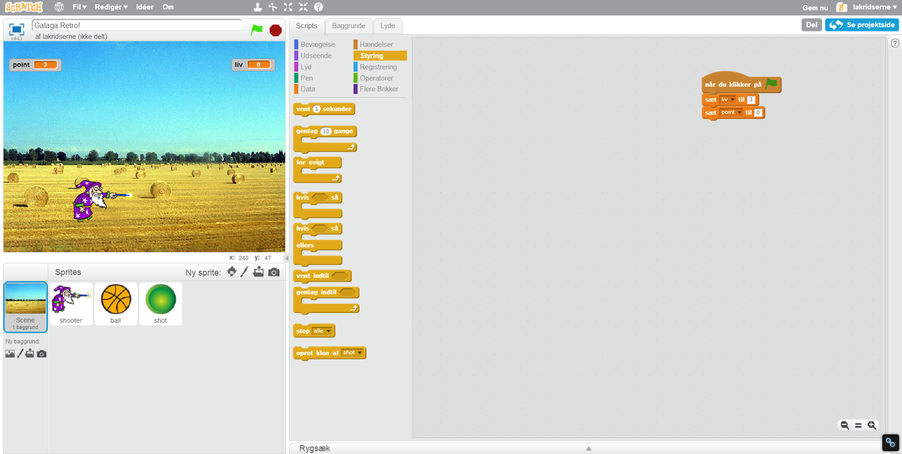

Du kan også spille spillet på [https://scratch.mit.edu/projects/93622409/](https://scratch.mit.edu/projects/93622409/) - her kan du også se den færdige kode og løsning - og prøve at finde evt. fejl.

Lad os få lavet spillet!

# Opstart af spillet

Når du står på Scratch hjemmeside - [https://scratch.mit.edu](https://scratch.mit.edu) - og er logget ind skal du klikke på "Find på" i øverste venstre hjørne.

Det vil åbne en ny side der ser sådan her ud:

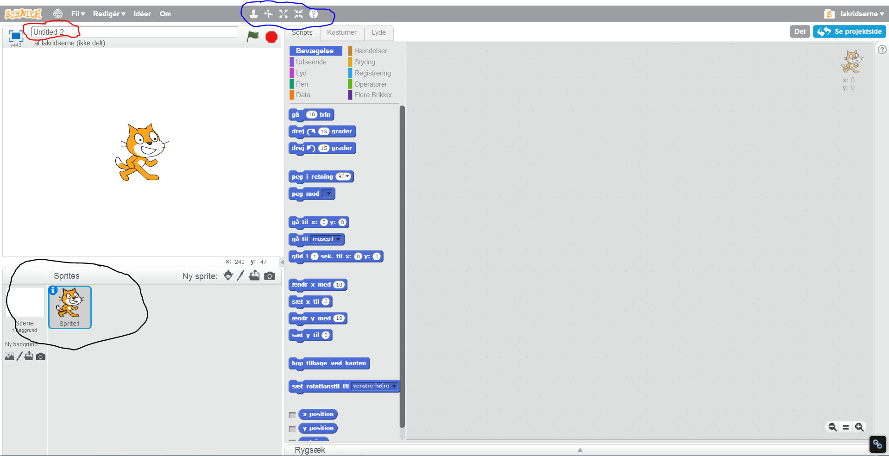

I dette skærmbillede her jeg lavet nogle forskellige markeringer. Den røde markering er der hvor du kan ændre navnet på spillet. Jeg har valgt at kalde det "Galaga Retro!" hos mig, men det kan du selv bestemme.

Den blå markering er nogle forskellige værktøjer du nok får brug for. Fra venstre ser du:

* Kopier

* Slet

* Forstør

* Formindsk

* Hjælp til brikkerne

Disse funktioner kan du også finde andre steder i Scratch, for eksempel er kopier og slet også i højrekliksmenuen, men nogen gange virker det ikke på alle computere, og derfor er det godt at vide at det ligger i toppen.

Den sorte markering viser en sprite. En sprite er et billeder der kan bevæges, roteres, og lign. baseret på det du fortæller computeren.

**Øvelse: **Brug værktøjet til at slette med til at slette den sprite med Scratch-katten der er der som standard (der hvor den sorte markering er omkring).

# Baggrunden

Din skærm skulle nu gerne se ud som på billedet (uden markeringerne):

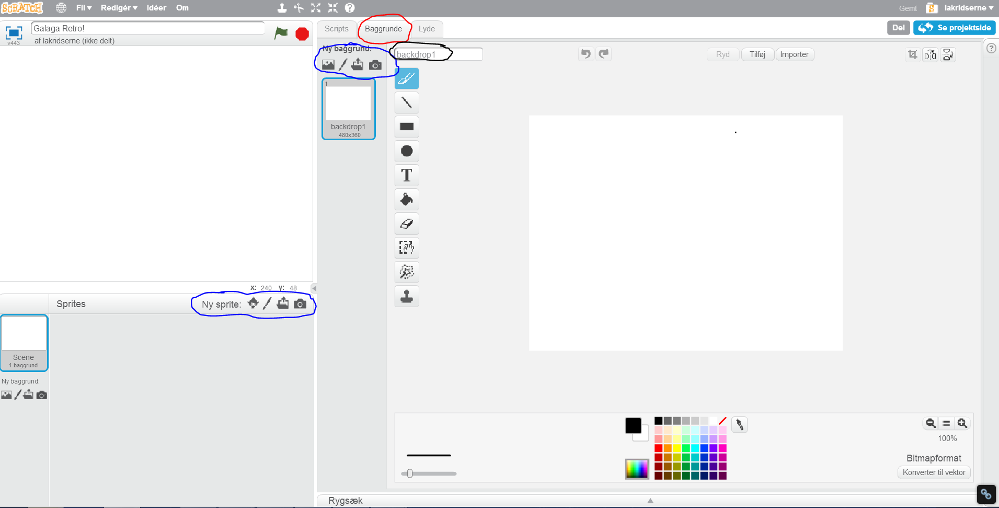

Når du klikker på Baggrunde (rød markering) vil du se tegnepladen. Jeg har lavet 2 blå markeringer.

De dækker begge over at tilføje grafiske elementer til dit Scratch spil. Den til venstre gælder for at lave en ny sprite - altså et nyt billede der kan flytte sig, rotere, osv., i forhold til baggrunden.

Den til højre gælder for baggrunden - eller hvis det er på en sprite - kostumet. Man kan skifte mellem forskellige baggrunde og kostumer i sin kode (under udseende). Det vil jeg ikke vise her.

De forskellige funktioner for at tilføje grafiske elementer er de samme begge steder:

* Vælg sprite fra biblioteket

* Tegn

* Vælg fra computeren

* Tag et billede

I denne guide vil vi kun bruge den første mulighed med ting fra Scratch biblioteket. Det er billeder at Scratch teamet har lagt op som man kan bruge i sine spil.

De andre muligheder kan du selv undersøge. Tryk på den første knap for at tilføje en baggrund mere. Scroll lidt ned og find billedet med den røde markering. Tryk på det og tryk på OK-knappen med den blå markering.

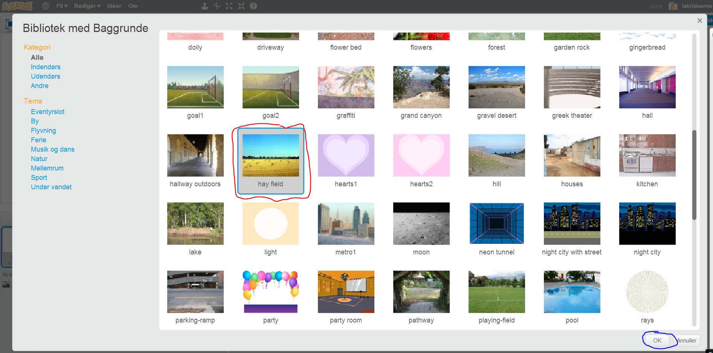

Når dette er gjort vil du se noget i retning af:

Fjern den hvide baggrund ved at trække på X’et jeg har markeret med rødt.

Det gør ikke den store forskel overordnet set. Grunden til at jeg alligevel beder dig slette den er, at den ikke skal bruges og nogen gange kan man komme til at få lavet nogle ting, hvor man undrer sig over hvorfor det ikke virker.

Så kan det nogen gange være fordi man bare har valgt en forkert baggrund.

Så overordnet set forvirrer det mere end det gavner.

Bagefter vi har slettet den hvide baggrund, så vi kun har den baggrund vi skal bruge tilbage skal vi have tilføjet nogle sprites. Det gør vi nu.

# Lave de nødvendige sprites

Som jeg har skrevet før er en sprite et billede der kan bevæge sig, man kan rotere det, skjule det, få ting til at reagere på det (for eksempel se om man rører ved det) og køre kode på det.

I vores spil skal vi bruge 3 sprites.

* shooter - jeg har valgt en tryllemand der skal skyde noget afsted - det gør ikke den store forskel hvad figur det er

* ball - en basketbold i dette tilfælde - vil prøve på at ramme tryllemanden, men hvis man rammer bolden først får man point

* shot - i dette tilfælde har jeg valgt en knap at gøre det med - men igen det kunne være en hvilken som helst ting - den bruger vi til at skyde efter vores bold

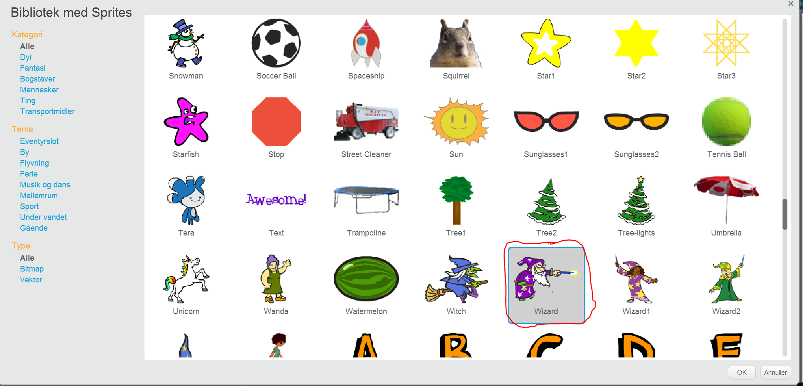

Tryllemanden finder du her. Derefter skal du tilføje de 2 markeringer på nedenstående billede:

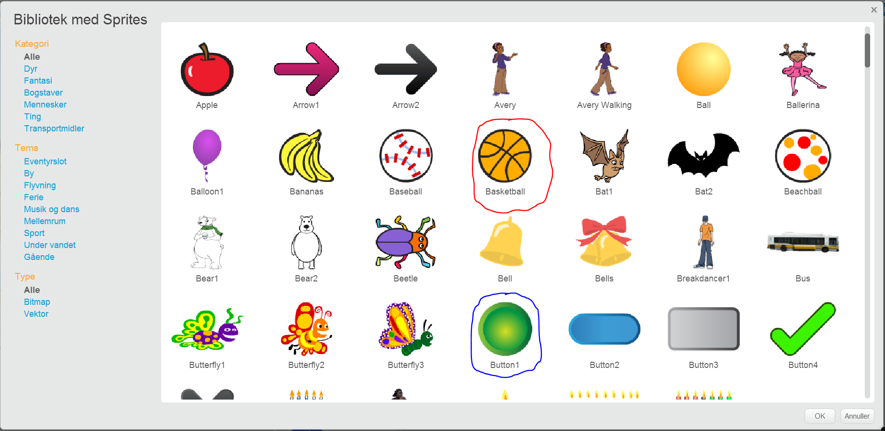

Når det er gjort bør du ende med et resultat der ser ud om på nedenstående skærmbillede:

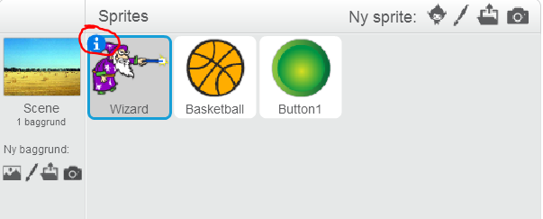

Hvis du klikker på i’et inde i den røde markering kan du ændre på visse indstillinger ved den pågældende sprite.

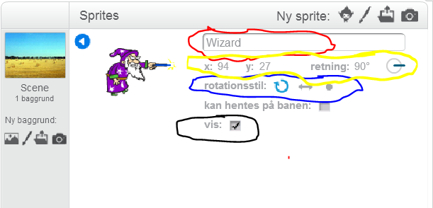

I den røde markering kan man ændre navnet. Vores sprites skal have følgende navne:

* Tryllemanden skal hedde shooter

* Basketball skal hedde ball

* Button1 skal hedde shot

Den blå indstilling med rotationsstil har at gøre med hvordan billedet bevæger sig. I Scratch kan en sprite nemlig bevæge sig til højre, venstre, op og ned. Vi kan her vælge at der er måder den ikke skal kunne bevæge sig på.

For tryllemanden skal vi ændre den så den står i midten - for resten af figurerne gør det ikke nogen forskel da de ser ens ud uanset hvilken retning de peger i.

Den sorte markering giver dig mulighed for at skjule eller vise et element. Det kan man også gøre i koden, og det kommer vi til at benytte os af.

Den gule markering giver dig mulighed for at se x og y koordinaterne hvor den er lige nu samt hvad retning den peger (og justere på dette). Du kan også se x og y koordinater på hvor din mus er i nederste højre hjørne af Scratch vinduet.

Når du er færdig kan du trykke på pilen tilbage i øverste venstre hjørne af det vindue med indstillinger for den sprite.

Med værktøjerne til at formindske bør du gøre de forskellige sprites mindre sådan at de når en mere passende størrelse.

Mit resultat ser sådan her ud:

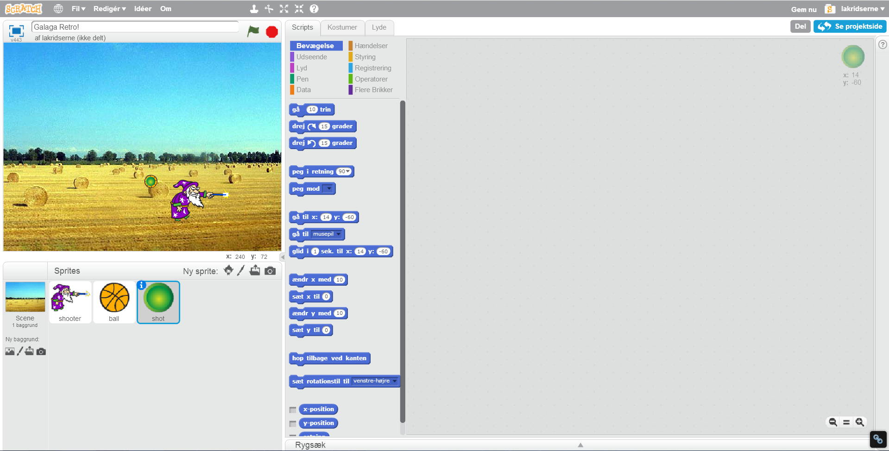

Det grafiske er ikke en facitliste, dette er blot hvordan jeg har gjort det. I er garanteret langt mere kreative end mig, så I kan lave noget der er langt sejere end jeg har gjort.

Det her var affslutningen på selve den grafiske del. Fra nu af kommer det hovedsageligt til at handle om selve programmeringen.

# Programmeringen

Også programmeringen er mit bud på en løsning. Programmering er det jeg er bedst til, og løsningerne er tænkt rimelig godt igennem, men man kan gøre tingene på mange forskellige måder.

Hvis du mener du har fundet en bedre løsning må du meget gerne sige til eller sende mig en email (se sidehoved) - så kigger jeg på det.

## Hændelser

Vi ser her selve Scripts fanen i Scratch. Denne fane bruges til at fortælle Scratch hvad der skal ske.

I den røde markering kan vi se en masse kategorier med forskellige ting. Vi kommer ikke til at bruge dem alle sammen i dette spil, men de fleste forklarer sig selv - og ellers kan man jo gå ned og udforske dem.

I den blå markering ligger selve de blokke man kan bruge og trække ind.

Men før vi går videre - hvad er hændelser?

Prøv at tænk på en morgen, hvor du skal op og i skole. Dit vækkeur ringer, eller en af dine forældre kommer ind for at vække dig. Det er en hændelse - et eller andet der sker et sted som skal få dig til at reagere på en bestemt måde.

En anden hændelse kunne være at lyskrydset skifter fra rød mand (så du skal vente før du må gå over fodgængerfeltet) til grøn mand (så du må gå over fodgængerfeltet).

I Scratch er en af de hændelser vi bruger mest "Når du trykker på det grønne flag". Det grønne flag er nemlig det der får et spil til at starte, så det giver os en mulighed for at lave noget kode der kører lige når vi starter spillet. Det kommer vi til at se meget mere til.

Dette er ikke en udførlig guide, så dem vi ikke gennemgår her kan du eksperimentere med selv eller spørge om hjælp til. Dette gælder i øvrigt for alle kommandoer i Scratch.

## Skjul sprites

Det første vi skal gøre er, at skjule et par sprites, som vi ikke skal bruge hele tiden. Det er nemlig sådan at vores shot og ball sprites skal være skjult undtagen når de skal bruges.

Du skal bruge en hændelse. Kan du gætte hvilken? For at finde ud af det skal vi finde ud af hvornår vi skal skjule disse sprites. Siden de altid skal være skjulte undtagen når vi rent faktisk skal bruge disse sprites ville det give mening at skjule dem når vi starter spillet.

Derfor bør koden for shot og ball være som på dette screenshot:

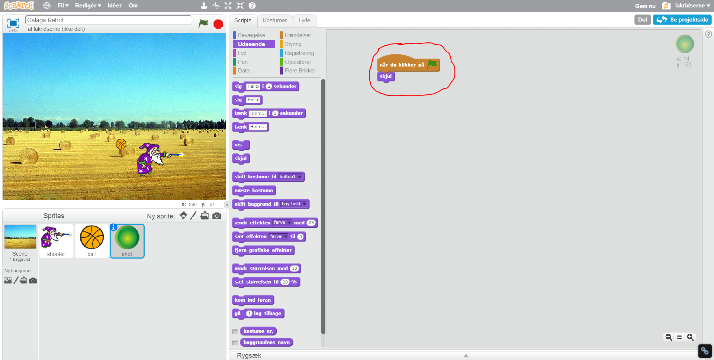

Som du kan se på den røde markering har jeg sat skjul sammen med "Når jeg klikker på det grønne flag". På den måde bliver det altid udført når programmet starter.

Du finder vis og skjul under Udseende.

Dermed siger du følgende med den kode du lige har lavet: "Når du klikker på det grønne flag skal du skjule denne sprite".

## Få manden til at gå

Nu skal vi til at have noget liv i manden. Han skal dog kun kunne gå frem og tilbage (højre eller venstre).

Vi kommer til at bruge "Flere brikker". Hvis du fortsætter med at programmere - og eventuelt i andre, mere tekstbaserede ting vil du opdage at det er ligesom en funktion, de har bare kaldt det noget andet.

I denne guide vil jeg derfor, helt bevidst, kalde det en funktion.

### Hvad er en funktion?

Måske har du nogle pligter derhjemme. Det kunne f.eks. være at sætte på bordet når I skal spise. Men da du var yngre skulle dine forældre forklare dig meget mere tydeligt, og i mange flere detaljer, hvordan du præcist skulle gøre.

Men du lærte efterhånden at når dine forældre siger at du skal sætte på bordet - så ved du godt at der skal finde nogle tallerkener, glas og bestik frem.

Nu er det sådan at computeren er ret dum. Så den skal have alt at vide helt ned i de mindste detaljer. Og den lærer ikke på samme måde som mennesker.

Men nu er programmører jo også dovne, så vi vil altid gå efter at få en opgave løst så nemt som muligt, uden at gå ned i kvalitet.

Derfor er en funktion et stykke kode du kan køre med blot en linje (eller i Scratch, en brik).

### Lav din første funktion

Prøv at gå ned og klik på "Flere brikker", og prøv at lav en ny brik. Den vil gerne have et navn (så du kan trække den ind et andet sted og genbruge koden).

Du kan kalde den funktion vi skal lave her for Gå. I andre programmeringssprog vil du opdage at man helst skal undgå æ, ø og å, samt mellemrum og andre tegn i den dur, men det går Scratch ikke så meget op i.

Derudover er der også en lille pil nedenunder du kan klikke på, og så folder der noget besynderligt noget ud.

Det du ser er en måde at give noget information til den funktion man vil lave. Hvis vi tager borddækningen kunne det være meget godt at vide hvor mange personer man skulle dække bordet til.

Så i stedet for at lave en ny funktion bare fordi man har 1 gæst en dag, og en anden dag har man måske 3 gæster, så giver man bare noget information med om hvor mange personer (eller gæster) der er.

Ret smart, ikke?

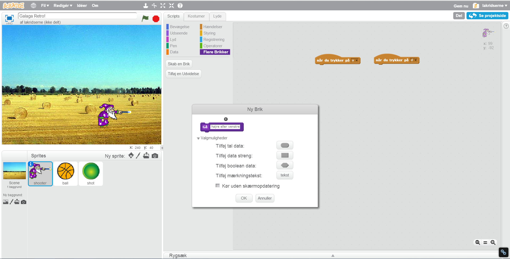

Jeg har valgt at bruge den der hedder "Tilføj data streng" - altså man tilføjer noget tekst. Jeg har valgt at kalde den “højre eller venstre” - det illustrerer meget godt hvad den skal bruges til - nemlig at bestemme om man er på vej mod højre eller venstre.

Når du har skrevet de ting ind som på det screenshot jeg har lavet skal du klikke på OK. Husk også at tilføje "Når jeg trykker på [tast]" (her er [tast] en tast på tastaturet - i det her tilfælde a og d). Så vil det se ud som på dette screenshot.

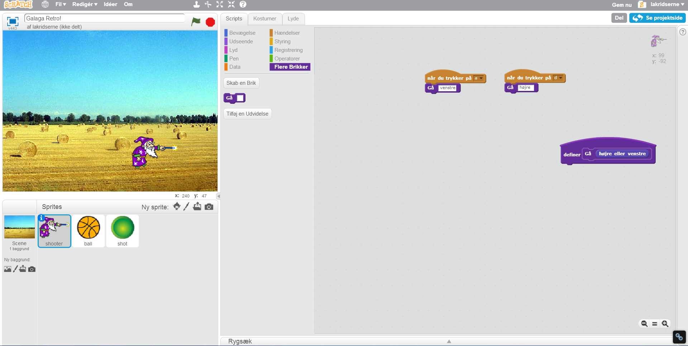

Bemærk hvordan du skriver højre og venstre i feltet til højre for Gå. Det er simpelthen at du fortæller den hvad vej den skal gå - du sender en oplysning med (i virkeligheden har du ikke fortalt den hvad vej den skal gå, du har bare givet den oplysningen, men det er det vi vil bruge det til).

Kan du selv finde ud af hvordan man tilføjer højre og venstre piletast?

### Bruge data fra funktioner

Men hvordan er det så vi bruger den oplysning om højre og venstre? Prøv at se på dette skærmbillede.

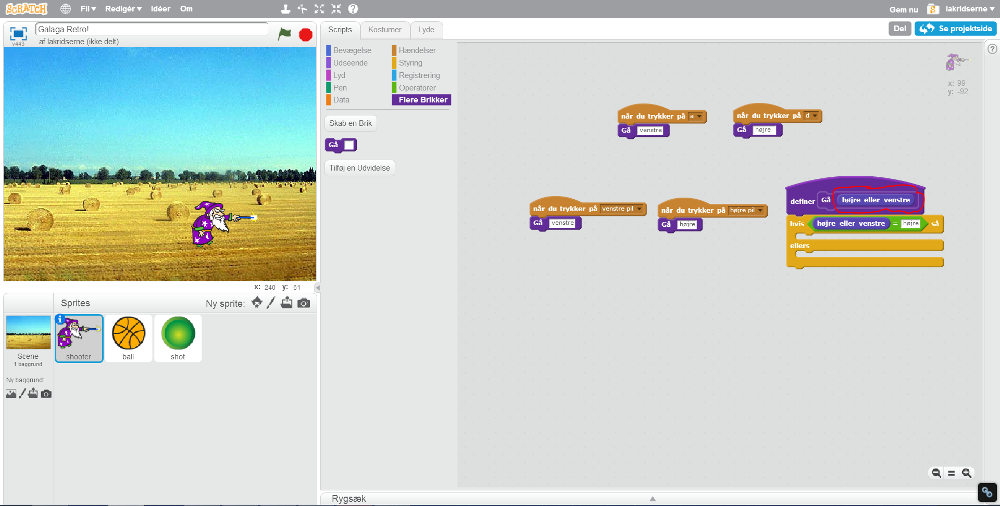

Ud over at have gjort så jeg også bruger højre og venstre pil (derfor funktioner er så smarte - jeg skal ikke kopiere koden - og rette i den flere steder - der er 1 linje kode, det er det!) har jeg også tilføjet noget under vores funktion Gå.

Jeg har tilføjet en hvis-ellers sætning. Den siger at hvis den har modtaget højre skal den udføre det der står i den første sætning (intet indtil videre) og ellers skal den udføre det i den anden (heller intet indtil videre).

Måden du får "højre eller venstre" ned på er at trække i den jeg har sat en rød ring om så kan du trække den ned. Du skal have en operator (f.eks. =) fra operatorer for at kunne bruge den.

Fra bevægelse fanen skal vi bruge nogle kommandoer. For det første skal vi bruge "peg i retning". Hvis du klikker på pilen til højre for kan du faktisk se hvilken retning det er i. Sæt dem begge som i skærmbilledet, så:

* højre: 90

* venstre: -90

Derefter skal du tilføje så den går 10 skridt hver gang den funktion bliver udført (hver gang man trykker på a, d eller piletasterne til højre eller venstre).

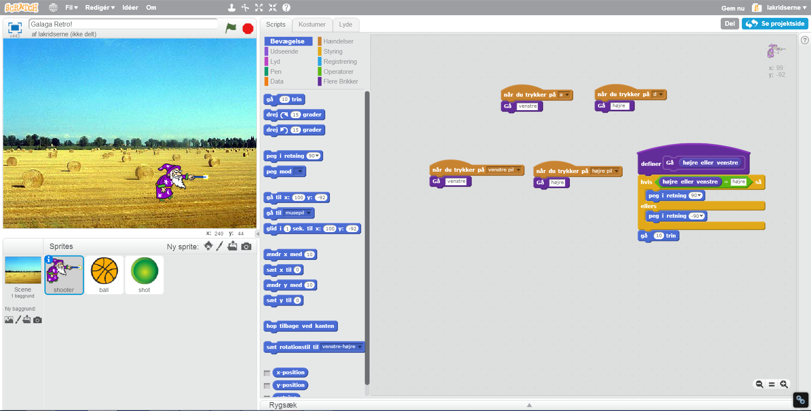

## Skyd!

Så skal vi se at få manden til at kunne skyde!

Han skal kunne skyde lige op i luften - og det er det.

For rent faktisk og skyde bliver vi nødt til at tænke lidt over hvad der sker når man skyder. Computeren skal jo have ret præcise instrukser om hvad der skal ske.

Så når vi skyder kommer der noget ud som skal ramme en modstander. Det "noget" er i dette spil den sprite vi kalder shot.

Og for at sikre at vi kan have flere på skærmen på samme tid laver vi en klon af det.

### Hvad er en klon?

En klon er en kopi af et objekt. Senere i programmering vil du finde ud af, at ting er arrangeret i klasser, og en klon er rent faktisk en ny instans af denne klasse.

Det er nok skrevet på en lidt for korrekt måde, sådan at du endnu ikke forstår det. Men det er simpelthen en måde at få den sprite til at dukke op flere gange, og udføre den samme kode, men på hver sin kopi.

### I gang

Som du kan se på skærmbilledet herunder har jeg her lavet det så når man trykker på mellemrum kører den funktionen Skyd (uden parametre - den tekst vi brugte før til at se om vi skulle gå til højre eller venstre).

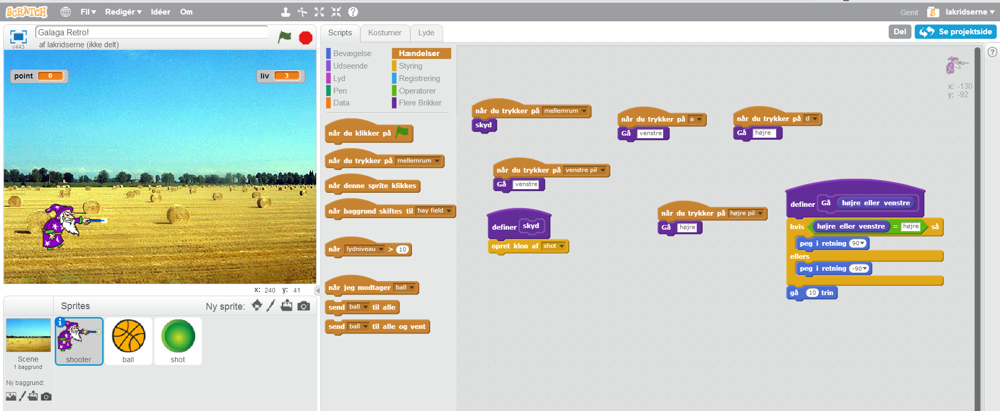

Skyd kan du også se - lad os lige se lidt nærmere på den.

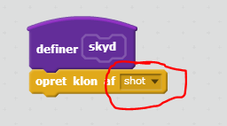

Som du kan se har jeg valgt at det er shot den skal oprette en klon af - ikke sig selv som den står på som standard. Måden du vælger det er at trykke på pilen ude til højre.

### Hvordan skal klonen opføre sig?

En klon skal ikke nødvendigvis gøre det samme som en sprite. Den kan sagtens have noget kode den kun udfører når den er en klon.

Den vil dog stadig udføre den øvrige kode for den sprite.

På skærmbilledet herunder kan du se at jeg har markeret "når jeg starter som klon" med rødt. Det er fordi vi skal bruge denne brik til at fortælle den hvad der skal ske når det er en klon der kører koden og ikke bare som en almindelig sprite.

Så træk den ind på skærmen. Egentlig er det lidt en selvstændig enhed og i min verden ville det give bedre mening at placere den som en hændelse. Jeg har forsøgt at finde et svar på hvorfor det ikke er en hændelse, men har ikke kunnet finde noget.

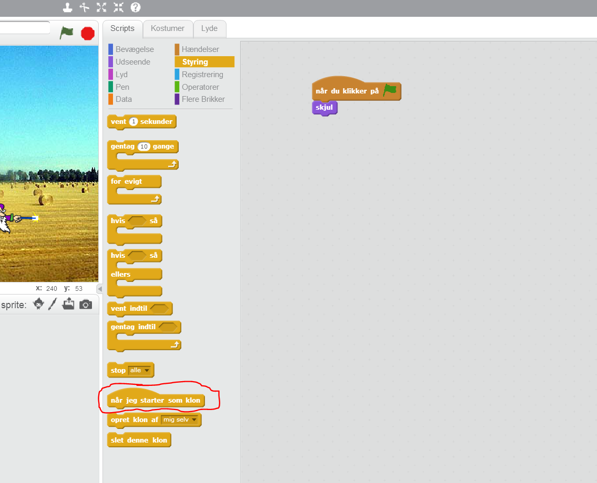

Når du har gjort det vil det se sådan her ud:

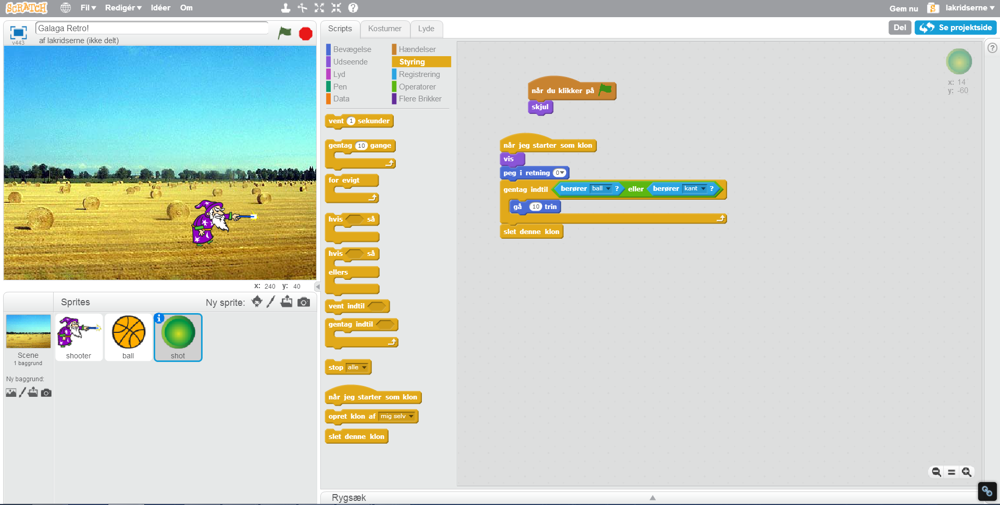

Ud over "når jeg starter som klon" har jeg også tilføjet lidt andet kode her.

Det første er "vis", som du finder under Udseende, og som vi bruger til at vise den nuværende klon. (Den bliver jo skjult ved start).

Jeg lavede det også så den altid peger opad. Det giver lidt sig selv når den kun må kunne skyde opad.

Endelig har jeg koden der får den til at bevæge sig - nemlig gentag indtil den berører ball eller den berører kanten. Her skal man være lidt opmærksom, da det bare er en kant man skal berøre og ikke kan sige en specifik kant (uden noget yderligere kode), så tænk over det hvis du bruger det i et spil.

Eller finder du under operatorer.

### Hvad er en operator egentlig?

Operatorer kender du garanteret allerede fra matematik. Du har bare aldrig kaldt dem det før. Hvis du rent faktisk går under operatorer vil du se der er operatorer såsom +, -, *, / og =.

Du kender måske også mindre end og større end (< og > - måske kender du dem som krokodillenæb - krokodillen vil altid gå efter det største).

Der er også operatorer som og, eller og ikke. Ligesom de ting du kender fra matematik er de også med til at kombinere ting, eller prøve at regne dem ud, men de er lidt specielle idet de ikke direkte ændrer på værdien, men tillader dig at bruge mere end en værdi.

Der er også en der giver dig et tilfældigt tal - her ville jeg ikke være enig med at det rent faktisk er en operator - i andre sprog er det som regel en funktion der laver et tilfældigt tal.

Vidste du i øvrigt at computeren er utrolig dårlig til at lave tilfældige tal? Det er den fordi det hele er baseret på matematik, så hvis du har de rigtige informationer kan du finde frem til de tal den har lavet og forudsige hvilke den vil lave næste gang.

Det prøver man at forhindre ved at lave nogle meget komplicerede matematiske funktioner - og lidt afhængig af hvad det er der skal bruge et tilfældigt tal kan man bruge forskellige data - for eksempel kigge på hvad millisekund det er på lige præcis det tidspunkt, støj på udgangen til hovedtelefoner og lign.

Men helt grundlæggende vil det altid være muligt i en eller anden udstrækning at finde ud af hvad nummer den vil generere om lidt hvis man har nok informationer om serveren.

Det er ikke noget problem for jer for den laver et "tilfældigt" nummer som det er nu, men hvis man har et system hvor man skal være helt sikker på det er tilfældigt - og man ikke kan forudsige hvad nummer den vil lave - eller har lavet - så er en computer på forhånd lidt dårlig til det.

Nu vil det se ud som på skærmbilledet her når du trykker på mellemrum.

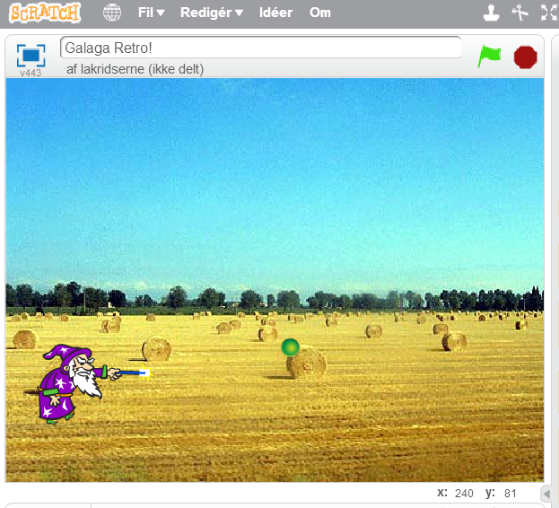

Hvis du ser på det skærmbillede kan vi nok godt blive enige om, at det ikke er det rigtige sted at den bliver skudt af fra. Den skulle jo gerne blive skudt af fra manden.

Grunden til det er at vi ikke bestemmer hvor den placeres henne. Så lad os gøre det nu.

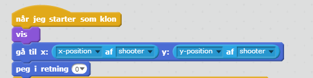

Under registrering finder du x-positionen og y-positionen af shooter. Det vil sige at vi får den til at gå til der hvor shooter er nu.

Lad os prøve at se hvordan det ser ud når vi nu kører koden.

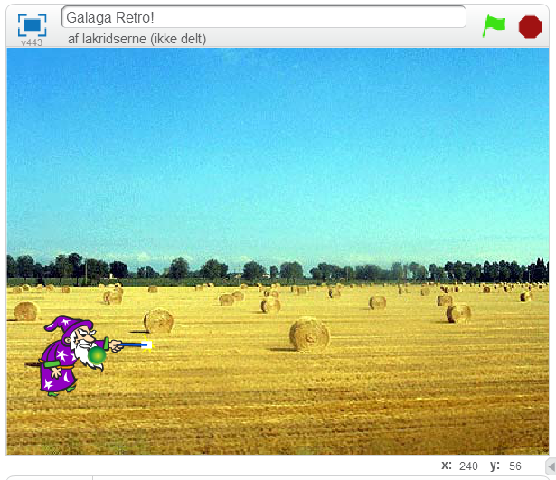

Se det var bedre, men den placerer den jo i midten af manden!

Nu kunne vi selvfølgelig ændre på midtpunktet på manden, men så ville vi også få problemer med hvordan han bevæger sig. Derfor har jeg valgt en anden løsning.

Den er en smule kompliceret, men vi tager det stille og roligt. Først skal vi bruge en variabel. Altså en beholder der indeholder nogle data. I dette tilfælde vil det enten indeholde 0 eller 1.

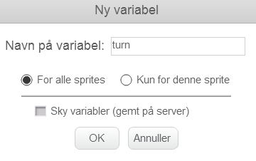

Du kan se her hvordan du laver selve den variabel vi skal bruge. Så ser det sådan her ud:

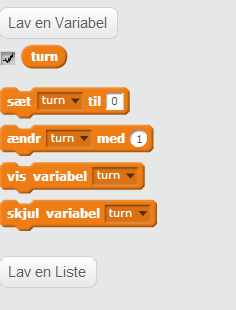

For at den rent faktisk kan sætte det ændrer vi vores kode på vores sprite kaldet shooter så den ser sådan her ud:

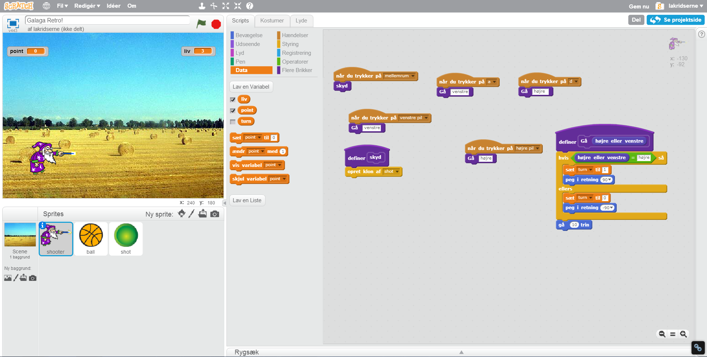

Her sætter vi den til 0 hvis den peger mod venstre og 1 hvis den peger mod højre. På den måde ved vi hvad vej den skal pege og kan bestemme hvor vi skal placere selve vores klon af shot.

Jeg har nemlig fundet ud af (ved at eksperimentere), at den skal have lagt 45 til eller trukket 45 fra på x-aksen for at være placeret korrekt.

Jeg har implementeret det her:

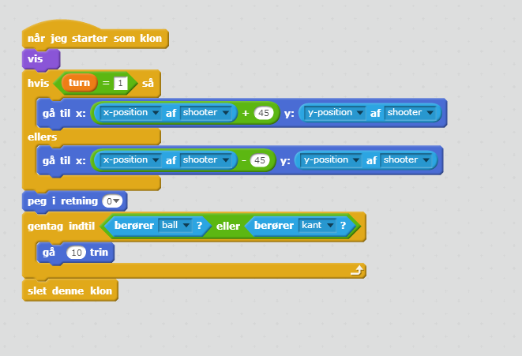

Den kode burde forklare sig selv, ellers spørg!

Hvis vi så ser på spillet nu ser det sådan her ud:

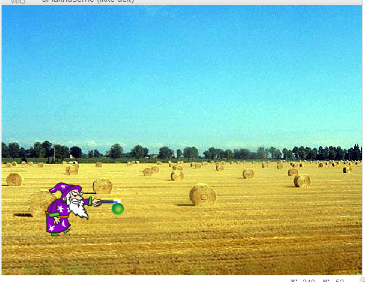

Hvis man ser på det kan man godt se at der måske skulle justeres lidt på y-aksen (op og ned) også, men hvis man rent faktisk trykker på mellemrum når man spiller det vil man ikke lægge mærke til den starter så tidligt, det vil faktisk se ud som om den starter på lige præcis det rigtige sted.

## Point og liv

Nu skal vi lave nogle point og liv.

Det er nogle variabler der tæller hver sin vej - når du bestemmer de skal tælle! Først skal du lave de 2 variabler (ligesom du lavede turn).

De variabler skal vises, og så skal du lave noget kode der nulstiller dem når spillet starter. Mit bud på en løsning kan du se nedenfor her.

Det er meget simpel kode.

Læg mærke til at det er min løsning. Der kan være mange forskellige løsninger på samme problem i programmering.

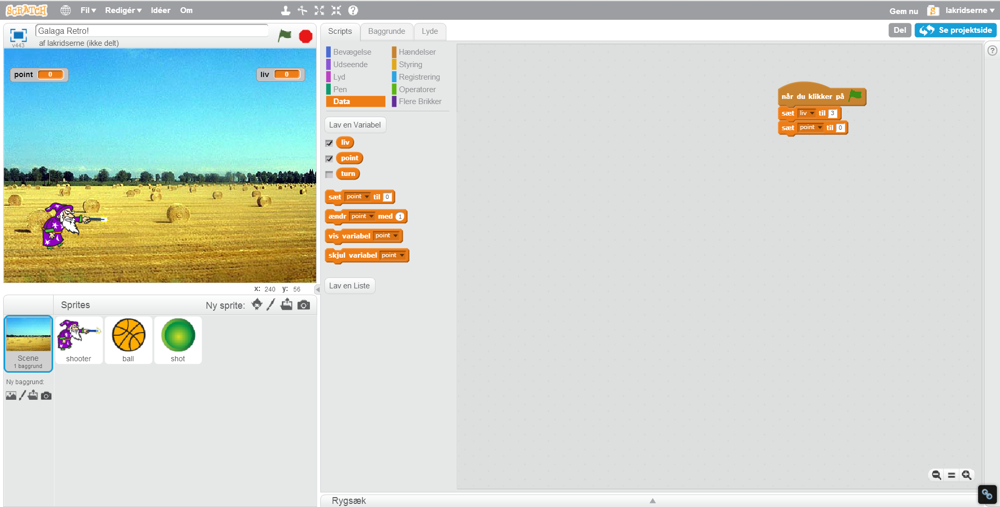

Nu skal vi have den til at finde ud af hvornår den skal skyde med bolde.

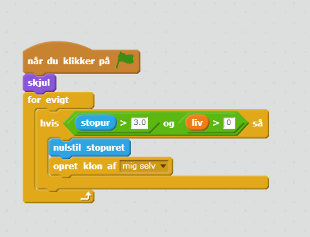

Denne kode skal laves på ball. Her bruger jeg stopuret til at sørge for at den skyder en bold afsted hvert 3. sekund så længe den har liv.

Det har nu givet os mulighed for at give nogle point. Det gør vi ved at finde ud af om shot rører ved ball.

Det kan du se jeg har lavet her nedenunder.

Jeg har også lavet en meddelelse kaldet ball som jeg sender til alle sprites. En meddelelse er lidt som at man råber "ball" ud til alle sprites, og så er der noget kode der sidder og spørger om det er blevet råbt. Hvis det er så udfører den noget kode.

Så det er en måde at overføre info til andre sprites.

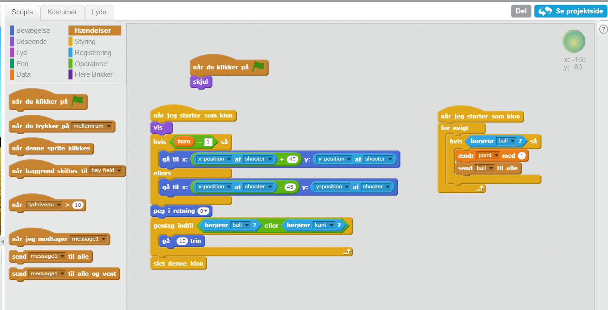

På vores ball sprite skal vi have denne korte kode:

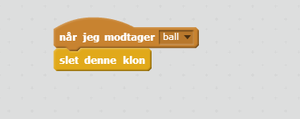

Altså - bolden bliver slettet når den modtager den meddelelse "ball". Vi kan nu tage den klon vi laver på vores “ball” sprite og rent faktisk placere den.

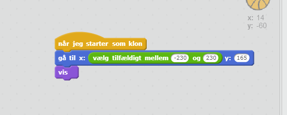

Her får vi den til at stå et tilfældigt sted på x-aksen (mellem -230 og 230) og det samme sted på y-aksen.

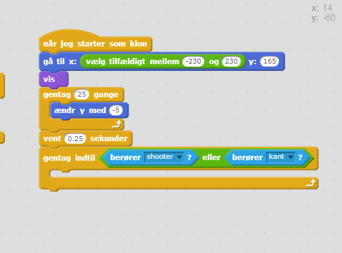

Her gentog jeg det samme 25 gange med at få den til at ændre y med -5. Det var noget jeg fandt ud af baseret på noget test.

Derefter venter den 0,25 sekunder (bemærk . og ikke ,). Igen fandt jeg ud af det via test.

Herefter gør den det inde i gentagelsesblokken indtil betingelsen (i dette tilfælde en af betingelserne) er opfyldt.

Inde i gentagelsesblokken har jeg valgt at den skal pege mod manden og gå mod ham.

Det bliver dermed meget svært at undgå bolden medmindre man får skudt den ned.

Til sidst, efter det hele, sletter vi lige klonen efter os.

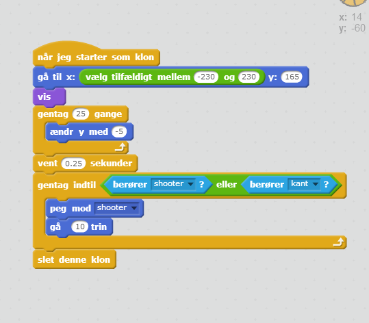

Sådan her ser det ud.

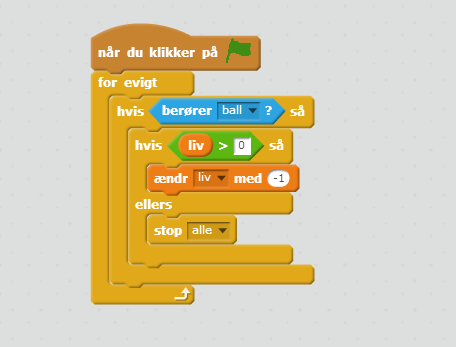

Dette er en kode der skal være på vores "shooter" sprite. Den tjekker om man rører ved ball - og hvis den gør trækker den et liv fra hvis man har nogen - ellers stopper den spillet.

Det var afslutnigen på denne guide. Dit færdige program skulle gerne se ud som på skærmbilledet.

