Scratch-tutorial: Udvidelser til "Grib mønterne!"
=================================================
*af Martin Dybdal*

I denne tutorial vil vi udvide spillet vi lavede sidst, så det bliver endnu sjovere!

## Del 1: Kostumer

Når man bevæger Scratch-katten med piletasterne, så ser det ud som om at han skøjter!

Lad os animere det så det ser ud som om at han går.

Til det skal vi bruge to forskellige billeder, og skifte mellem dem hver gang man tager et skridt:

Kostume 1: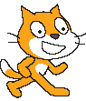             Kostume 2: 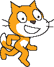

Start med at vælge den "Sprite" der skal skifte kostume: 

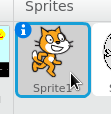

Klik på 

Husk at katten kunne bevæge sig når man trykkede på piletasterne:

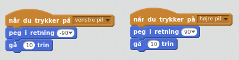

Nu vil vi gøre så han også skifter kostume når man trykker på de samme taster!

Det gør man ved at indsætte brikken "Næste kostume":

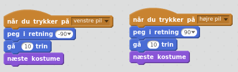

Afprøv spillet!

### Hvordan virker det?

Klik på "Kostumer":

Nu kan du se at de to kostumer allerede er der:

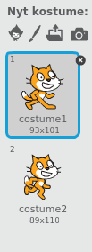

Så hver gang man trykker på en knap skifter den mellem de to.

Du kan også tilføje dine egne kostumer, så han f.eks. har en hat på og går med stok.

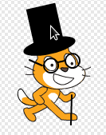

## Del 2: Point

For at gøre spillet til en konkurrence, skal vi have point når vi spiller.

### Vejledning

Vi skal tilbage til mønten. Tryk på mønten nede i vores sprites:

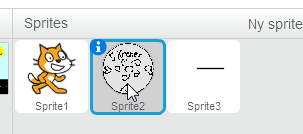

Og find dens Scripts ("Hjernen"):

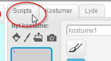

For at gemme pointene, skal vi have en "variabel". Klik på: 

Og tryk: 

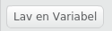

Vi skal give den et navn, f.eks. "Point":

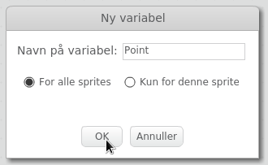

Nu er den dukket op i hjørnet:

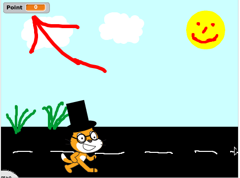

Så skal vi bare have den til at tælle op, hver gang vi fanger en mønt!

Vælg:

Og indsæt den sådan at den bliver kørt hver gang "mønten" har rørt ved “katten”:

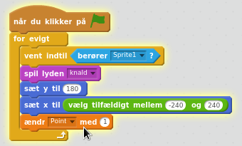

Afprøv spillet!

Prøv det igen, hvad sker der når du spiller flere gange?

Brug evt. denne klods til at fikse problemet:

## Del 3: Flere ting!

Det er kedeligt at der kun falder én ting ned, lad os tilføje nogle flere!

### Vejledning

Kopier mønten:

Nu er der to med samme udseende:

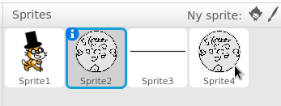

Lad os give den nye et andet udseende.

Klik:

Og klik:

Og tegn noget nyt og sjovt!

Tilføj evt. endnu flere ting på samme måde.

## Del 4: Liv

For at gøre spillet udfordrende, skal man også kunne tabe. Det er ikke sjovt hvis man aldrig taber. Lad os gøre så man starter med 5 "liv" og hver gang man ikke griber mønten, så mister man ét.

### Vejledning

Lav en ny "variabel", kald den “Liv”. 

Se afsnittet om Point, hvis du ikke kan huske hvordan man gjorde!

Nu skal vi have den til at tælle ned hver gang en mønt rammer jorden uden at vi nåede at gribe den. 

Gå ind i "hjernen" (scriptet) til mønten og tilføj:

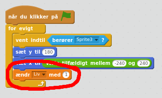

Men det betyder at den tæller opad! Vi skal tælle nedad, så du skal rette det til -1:

Du skal også tilføje en brik der gør at man starter med 5 liv, men hvor den skal være må du selv finde ud af!

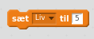

Spil dit spil og vis det til dine venner!

Her er nogle idéer til hvad man ellers kan gøre:

* Skift baggrund når spillet er slut ("Game over")

* Få "ekstra liv" til at falde ned, som man kan gribe

