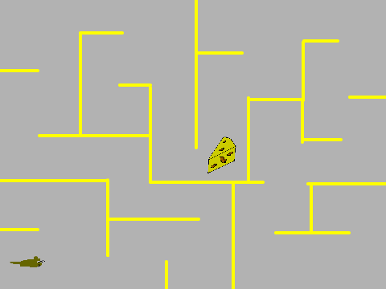
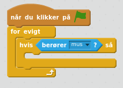

Scratch-tutorial: Labyrinten
============================
*af Martin Dybdal, idé: Martin Exner*

I denne tutorial vil jeg forklare hvordan du kan lave et spil hvor musen Piv skal finde ost i lastrummet i Kaptajn Hacks sørøverskib!

Start med at oprette en konto på <http://scratch.mit.edu> hvis du ikke allerede har en. Ellers kan du ikke gemme dit spil til næste gang.

Hvis du får problemer mens du er derhjemme, så skriv et spørgsmål på Coding Pirates-forummet: <http://forum.codingpirates.dk/>

## Del 1: Tegn labyrinten og spilleren

Først skal vi tegne hvordan musen skal se ud og labyrinten den skal løb rundt i.

### Vejledning

Start med at klikke på penslen, for at oprette en ny figur (engelsk: sprite):

Tegn hvordan musen skal se ud og sørg for at du tegner den præcis midt på skærmen! Her er min:

Lad os give figuren et navn. Det gøres ved at trykke på det lille "i" ved siden af figuren:

Jeg kalder min for "mus":

Vi skal også have en labyrint! Den tegner vi som en "baggrund". For at lave en baggrund skal du klikke her:

Og så her:

Tegn nu en labyrint. 

**Vigtigt:** Brug den samme farve til alle væggene!

**Hint:** Hold "Shift" (⇧) nede mens du bruger linje-værktøjet, for at tegne helt lige streger!

Her er min labyrint:

Gangene er blevet lidt små i forhold til musen, så lad os gøre musen lidt mindre, så den kan komme rundt. 

Det gør du ved at trykke på:

i toppen af skærmen og derefter på figuren der skal blive mindre! Sådan det var bedre:

## Del 2: Styr med piletasterne

Nu skal vi have musen til at bevæge sig!

### Vejledning

Vælg først musen:

Tryk derefter på fanebladet "Scripts":

Vælg "Hændelser":

Vælg denne brik og flyt den ind på kodeområdet (Scratch-katten’s "hjerne"):

og ændr den til "højre pil" ved at klikke på den sorte pil:

Kobl den sammen med denne brik:

Og så denne:

Sådan! Så burde du have:

Byg nu det samme igen, men denne gang skal musen gå til venstre:

Nogle kloge mennesker har fundet på at:

* -90 betyder venstre

* 90 betyder højre

Prøv spillet ved at trykke på det grønne flag: 

Nu kan man gå frem og tilbage, men vi skal også kunne gå op og ned!

**Opgave**

Prøv om du selv kan finde ud af at gøre så når du trykker på "pil opad" og “pil nedad”, så bevæger musen sig i den retning!

### Musen vender på hovedet!

Hvis musen vender på hovedet når du går til venstre:

Du behøver ikke forstå hvorfor, bare gør det!

## Del 3: Ikke snyde!

Hvis du har prøvet spillet, så er det ikke så sjovt endnu, for man kan jo gå igennem væggene. Lad os ændre på det!

**Vejledning**

Lad os først tænke over hvad vi skal. Vi skal have gjort, sådan at man ikke rykker fremad, når man går ind i "noget der er gult" (eller den farve som du har tegnet din labyrints vægge). Vi skal altså holde øje med om man går ind i noget gult og hvis man gør det, så skal man rykkes tilbage hvor man kom fra.

Vi laver det som et nyt script, så vi skal have sådan en start-brik:

alt hvad der er nedenunder den bliver udført når man starter spillet.

Gå nu ind under styring:

og find den her brik:

Den gentager det der inde i den UENDELIGT! Prøv f.eks. at gøre sådan her:

Nu vil musen hele tiden gå baglæns, fordi jeg skrev -5!

Vi ville gerne have den til at gå baglæns, men kun **hvis** den rørte noget gult! Så vi skal have fat i en "**hvis **… **så**" brik. Den ligger også under “styring”:

Og inde i den skal vi så fortælle

1. hvad det er den skal tjekke (at vi rører en gul væg)

2. hvad det er den skal gøre hvis vi rører væggen (gå baglæns)

Det første kan vi gøre ved at gå ind under  og vælge brikken

For at ændre så den tjekker gul:

* Tryk på det røde felt

* Tryk derefter på noget gult (væggen i din labyrint)

At gå baglæns har vi allerede fundt ud af, vi skal bare "gå -5 trin":

Nu kan vi sætte det hele sammen:

## Del 4: Tegn en ost

Lad os placere noget ost i lastrummet!

### Vejledning

Tryk på penslen for at lave en ny figur:

Ændr navnet til "ost1"

Tegn osten. Her er hvordan den ser ud:

## Del 5: Opdag når musen rører ved osten

Vi skal have lavet et script der opdager hvornår musen har taget osten og flytter osten til et nyt sted i labyrinten!

**Vejledning**

Nu skal du vælge osten hvis du ikke allerede har gjort det:

og trykke op "Scripts":

Vi skal have gjort lidt ligesom vi gjorde da vi opdagede om vi rørte en væg. Så start med at bygge:

"hvis"-brikken skal nu tjekke om osten rører ved musen, så vi skal bruge denne brik:

og indstille den til at blive aktiveret når vi rører ved musen:

Så nu har vi:

Det der står inde i "maven" af hvis-brikken bliver kørt hver gang osten rører ved musen! 

Hvad skal vi have til at ske? Vi kunne f.eks. flytte osten til et andet sted på brættet.

Nu virker spillet! 

Lad dine venner prøve det næste gang de er på besøg. Det kan være de har nogle forslag til hvordan det bliver flottere eller sjovere!

## Udvidelser

Der er massere af muligheder for at udvide spillet, her er nogle idéer:

 * Tilføj en modspiller, så man kan konkurrere om hvem der kan få flest oste
 * Tilføj teleportere, så man kan hoppe fra den ene ende af banen til den anden
 * Tilføj flere baner, så når man har klaret den første, så skifter baggrunden til en anden labyrint
 * Tilføj point-tæller
 * Tilføj nøgler og døre, så man skal samle en nøgle op for at åbne specielle døre
 * Game-over skærm
 * Tillykke-skærm når man har vundet
 * Menu til at starte spillet

